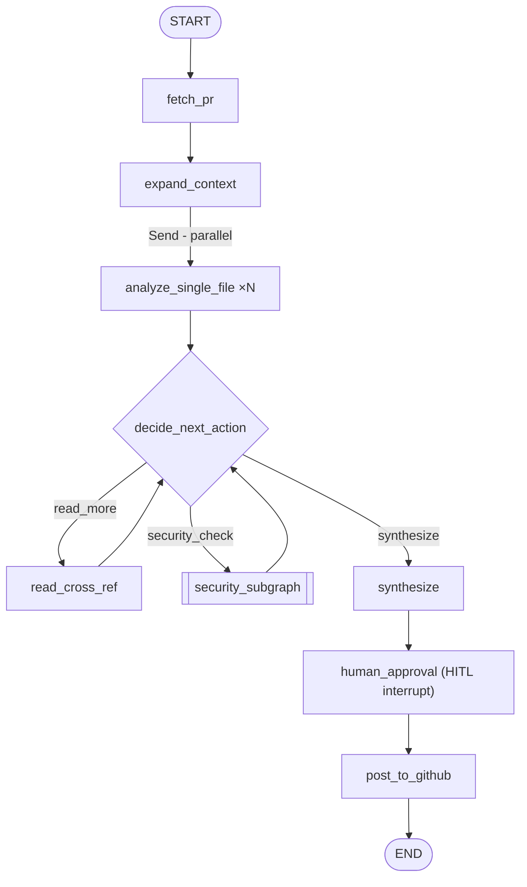

# PR Review Agent — Project Overview

**Stack:** LangGraph · LangChain · Claude Sonnet 4.6 · PyGithub  
**Delivery:** 2 phases

---

## What We Are Building

A GitHub PR Review Agent that automatically reviews pull requests the way a senior engineer would — not just scanning the diff, but understanding the broader context of the change.

Given a PR URL, the agent:

1. Fetches the diff and metadata from GitHub
2. Reads the full base-branch content of every changed file — not just what changed, but what surrounds it
3. Detects whether the changes touch sensitive areas (auth, sessions, permissions) and runs a dedicated security scan if so
4. Dynamically decides if it needs to read additional related files before it can give a confident review
5. Runs per-file analysis in parallel across all changed files
6. Synthesizes a final structured review with an overall verdict (APPROVE / REQUEST CHANGES / COMMENT), ranked findings, and suggested next steps
7. Pauses for human approval before posting the review as a GitHub PR comment

The agent is not a static pipeline. It loops, branches, and decides what to investigate next — making it a genuine use case for LangGraph's graph-based orchestration rather than a simple chain.

---

## Agent Flow



---

## LangGraph Concepts Covered

```
                        PR Review Agent
                              │
          ┌───────────────────┼───────────────────┐
          ▼                   ▼                   ▼
      LangGraph           Tool Calling            LLM
          │                   │                   │
     State / edges        GitHub / code        Reasoning
     loops                operations
     branching
     parallelism
     subgraphs
```

---

### LangGraph Features in Detail

| Category | Feature | Implementation |
|---|---|---|
| **Graph** | `StateGraph` | Core workflow definition |
| **Graph** | Nodes | `fetch_pr`, `expand_context`, `analyze_single_file`, `decide_next_action`, `synthesize` |
| **Graph** | Static edges | Linear steps (fetch → expand) |
| **Graph** | Conditional edges | `decide_next_action` routes to `read_more / security_check / synthesize` |
| **State** | `TypedDict` schema | `PRState` — typed fields for all graph data |
| **State** | `Annotated` reducers | `operator.add` merges parallel `file_reviews` and `observations` |
| **Routing** | Cycles | `read_cross_ref → decide_next_action` loop, guarded at 3 iterations |
| **Parallelism** | `Send` API | Fan-out one `analyze_single_file` task per changed file |
| **Subgraphs** | Security subgraph | Compiled independently, mounted as a node in the main graph |
| **Tool Calling** | GitHub API | `fetch_pr`, `expand_context`, `read_cross_ref`, `post_to_github` |
| **Tool Calling** | LLM JSON output | `decide_next_action` returns structured JSON for routing |
| **Persistence** | `SqliteSaver` / `PostgresSaver` | State checkpointed after every node |
| **Persistence** | `thread_id` | Stable run identity across sessions |
| **HITL** | `interrupt` | Graph pauses at `human_approval` before posting |
| **HITL** | Resume | `graph.invoke(None, config)` restores and continues |
| **Streaming** | `astream_events` | Live node-by-node progress to terminal |

---

## LangGraph Feature Map

| Feature | Where Used | Phase |
|---|---|---|
| `StateGraph` | Entire workflow | 1 |
| `TypedDict` state + `Annotated` reducers | `PRState` schema | 1 |
| Conditional edges | `decide_next_action` routing | 1 |
| Cycles | read → decide → read loop (max 3) | 1 |
| `Send` API (parallel fan-out) | `analyze_single_file ×N` | 1 |
| Subgraphs | Security scan compiled as a node | 1 |
| Tool / API calls | GitHub fetch, LLM JSON output | 1 |
| `SqliteSaver` / `PostgresSaver` | Checkpoint every node | 2 |
| `interrupt` (HITL) | Human approval before posting | 2 |
| Resume from checkpoint | `graph.invoke(None, config)` | 2 |
| `astream_events` | Live terminal streaming | 2 |

---

## Sequence — Phase 1

```
User     Graph      GitHub     LLM     SecuritySubgraph
 │         │           │         │            │
 │─invoke─►│           │         │            │
 │         │─fetch────►│         │            │
 │         │◄─diff─────│         │            │
 │         │─expand───►│         │            │
 │         │◄─files────│         │            │
 │         │                     │            │
 │         │──[Send: parallel]──►│            │
 │         │   analyze ×N        │            │
 │         │◄──[file reviews]────│            │
 │         │                     │            │
 │         │─decide─────────────►│            │
 │         │◄─"security_check"───│            │
 │         │──────────────────────────────────►│
 │         │◄─findings────────────────────────│
 │         │                     │            │
 │         │─decide─────────────►│            │
 │         │◄─"read_more"────────│            │
 │         │─read_cross_ref────►│             │
 │         │◄─contents──────────│             │
 │         │                     │            │
 │         │─decide─────────────►│            │
 │         │◄─"synthesize"───────│            │
 │         │─synthesize─────────►│            │
 │         │◄─final review───────│            │
 │◄─result─│                                  │
```

---

## Sequence — Phase 2 (HITL + GitHub post)

```
User     Graph      GitHub     LLM      Human
 │         │           │         │         │
 │─invoke─►│           │         │         │
 │         │  ... Phase 1 flow ...         │
 │         │─synthesize─────────►│         │
 │         │◄─draft review───────│         │
 │         │                               │
 │         │─interrupt────────────────────►│
 │         │        (graph paused)         │
 │         │                      [reviews draft]
 │         │                      [approves / edits]
 │         │◄─resume()────────────────────│
 │         │                               │
 │         │─post_to_github────►│          │
 │         │◄─PR comment posted─│          │
 │◄─done───│                               │
```

---

## Delivery

**Phase 1** — Working agent: fetch → parallel analysis → adaptive routing → security subgraph → structured review  
**Phase 2** — Production: checkpointing · HITL interrupt · GitHub comment posting · streaming CLI
