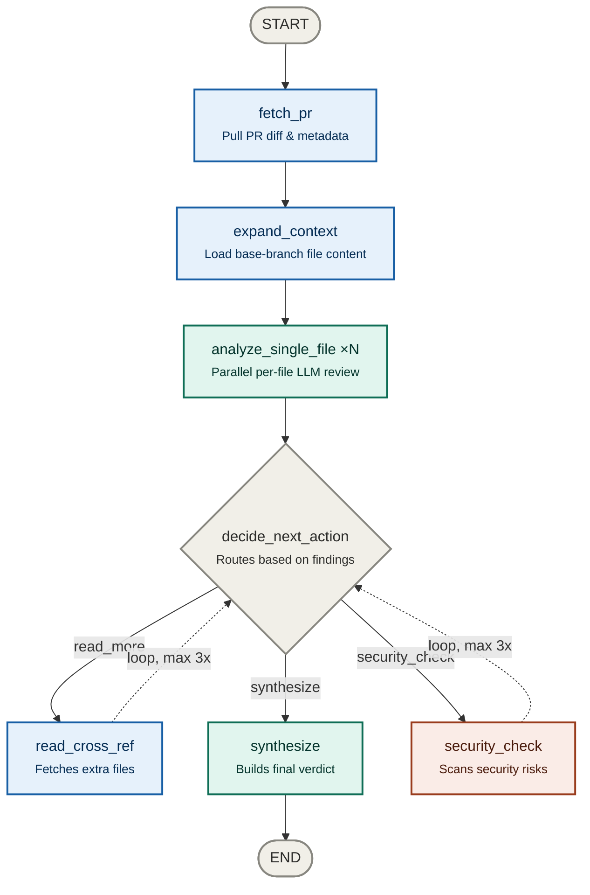
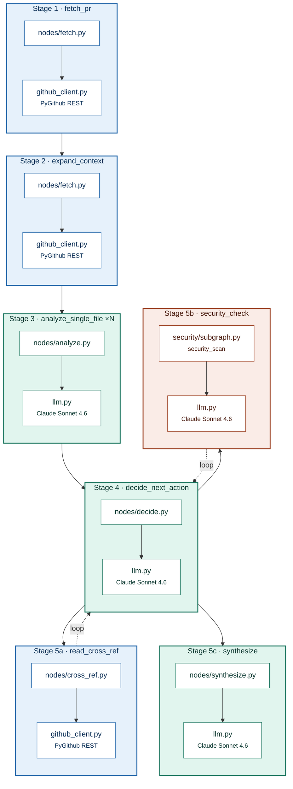

# PR Review Agent — Phase 1: File Structure

```
pr_review_agent/
├── .env.example
├── requirements.txt
├── state.py
├── llm.py
├── github_client.py
├── nodes/
│   ├── __init__.py
│   ├── fetch.py
│   ├── analyze.py
│   ├── decide.py
│   ├── cross_ref.py
│   └── synthesize.py
├── security/
│   ├── __init__.py
│   └── subgraph.py
├── graph.py
└── main.py
```

---

## `requirements.txt`

```
langgraph
langchain
PyGithub
python-dotenv
```

---

## `.env.example`

```bash
GITHUB_TOKEN=ghp_...
AI_STUDIO_API_KEY=sk-...
```

---

## `state.py`

```python
from typing import TypedDict, Annotated, Literal
import operator


class PRState(TypedDict):
    # Input
    pr_url: str
    question: str

    # Fetched
    pr_metadata: dict
    changed_files: list[str]
    diff_by_file: dict[str, str]

    # Context
    context_files: dict[str, str]
    cross_ref_files: list[str]
    cross_ref_contents: dict[str, str]

    # Analysis
    file_reviews: Annotated[list[dict], operator.add]
    observations: Annotated[list[str], operator.add]
    security_findings: list[dict]

    # Routing
    next_action: Literal["read_more", "security_check", "synthesize"]
    iteration: int

    # Output
    final_review: str
```

---

## `llm.py`

```python
import os
from dotenv import load_dotenv
from langchain_anthropic import ChatAnthropic

load_dotenv()

model = ChatAnthropic(
    model="claude-sonnet-4-6",
    api_key=os.environ["ANTHROPIC_API_KEY"],
)
```

---

## `github_client.py`

```python
import os
from github import Github


def get_repo_and_pr(pr_url: str):
    g = Github(os.environ["GITHUB_TOKEN"])
    parts = pr_url.rstrip("/").split("/")
    repo = g.get_repo(f"{parts[-4]}/{parts[-3]}")
    pr = repo.get_pull(int(parts[-1]))
    return repo, pr


def get_repo(pr_url: str):
    g = Github(os.environ["GITHUB_TOKEN"])
    parts = pr_url.rstrip("/").split("/")
    return g.get_repo(f"{parts[-4]}/{parts[-3]}")


def get_file_at_ref(repo, filename: str, ref: str) -> str:
    try:
        content = repo.get_contents(filename, ref=ref)
        return content.decoded_content.decode("utf-8")
    except Exception:
        return ""
```

---

## `nodes/__init__.py`

```python
from .fetch import fetch_pr, expand_context
from .analyze import analyze_single_file, fan_out_files
from .decide import decide_next_action
from .cross_ref import read_cross_ref
from .synthesize import synthesize

__all__ = [
    "fetch_pr",
    "expand_context",
    "analyze_single_file",
    "fan_out_files",
    "decide_next_action",
    "read_cross_ref",
    "synthesize",
]
```

---

## `nodes/fetch.py`

```python
from state import PRState
from github_client import get_repo_and_pr, get_repo, get_file_at_ref


def fetch_pr(state: PRState) -> dict:
    repo, pr = get_repo_and_pr(state["pr_url"])

    changed_files, diff_by_file = [], {}
    for f in pr.get_files():
        changed_files.append(f.filename)
        diff_by_file[f.filename] = f.patch or ""

    return {
        "pr_metadata": {
            "title": pr.title,
            "author": pr.user.login,
            "base": pr.base.ref,
            "body": pr.body or "",
        },
        "changed_files": changed_files,
        "diff_by_file": diff_by_file,
    }


def expand_context(state: PRState) -> dict:
    repo = get_repo(state["pr_url"])
    base = state["pr_metadata"]["base"]

    context_files = {
        filename: get_file_at_ref(repo, filename, base)
        for filename in state["changed_files"]
    }
    return {"context_files": context_files}
```

---

## `nodes/analyze.py`

```python
from langgraph.types import Send
from langchain_core.messages import HumanMessage
from state import PRState
from llm import model

REVIEW_PROMPT = """\
You are a senior engineer reviewing a pull request.

File: {filename}

--- DIFF ---
{diff}

--- FULL FILE (base branch) ---
{context}

--- RELATED FILES ---
{cross_ref}

Review this change. Report:
1. Correctness issues
2. Security concerns
3. Performance concerns
4. Missing tests
5. Style / readability

Be concise. Use bullet points. Say "LGTM" if no issues.
"""


def analyze_single_file(state: PRState) -> dict:
    filename = state["_current_file"]
    cross_ref = "\n\n".join(
        f"// {f}\n{c[:2000]}"
        for f, c in state.get("cross_ref_contents", {}).items()
    )
    response = model.invoke([
        HumanMessage(content=REVIEW_PROMPT.format(
            filename=filename,
            diff=state["diff_by_file"].get(filename, "")[:4000],
            context=state["context_files"].get(filename, "")[:4000],
            cross_ref=cross_ref[:3000],
        ))
    ])
    return {
        "file_reviews": [{"file": filename, "review": response.content}],
        "observations": [f"Reviewed {filename}"],
    }


def fan_out_files(state: PRState) -> list[Send]:
    return [
        Send("analyze_single_file", {**state, "_current_file": f})
        for f in state["changed_files"]
    ]
```

---

## `nodes/decide.py`

```python
import json
from langchain_core.messages import HumanMessage
from state import PRState
from llm import model

DECISION_PROMPT = """\
You are orchestrating a PR review.

Changed files: {changed_files}
Files already read: {files_read}
Observations:
{observations}

Decide the next action:
- "read_more": need more context (list which files)
- "security_check": diff touches auth/crypto/sessions/permissions
- "synthesize": enough info for final review

Respond ONLY in JSON:
{{"action": "read_more"|"security_check"|"synthesize",
  "files_to_read": [],
  "reason": "..."}}
"""


def decide_next_action(state: PRState) -> dict:
    if state.get("iteration", 0) >= 3:
        return {"next_action": "synthesize"}

    files_read = (
        list(state.get("context_files", {}).keys())
        + list(state.get("cross_ref_contents", {}).keys())
    )

    response = model.invoke([
        HumanMessage(content=DECISION_PROMPT.format(
            changed_files=state["changed_files"],
            files_read=files_read,
            observations="\n".join(state.get("observations", [])),
        ))
    ])

    result = json.loads(response.content)
    return {
        "next_action": result["action"],
        "cross_ref_files": result.get("files_to_read", []),
        "iteration": state.get("iteration", 0) + 1,
        "observations": [f"Decision: {result['reason']}"],
    }
```

---

## `nodes/cross_ref.py`

```python
from state import PRState
from github_client import get_repo, get_file_at_ref


def read_cross_ref(state: PRState) -> dict:
    repo = get_repo(state["pr_url"])
    base = state["pr_metadata"]["base"]

    already_read = state.get("cross_ref_contents", {})
    new_contents = {
        filename: get_file_at_ref(repo, filename, base)
        for filename in state.get("cross_ref_files", [])
        if filename not in already_read
    }

    return {
        "cross_ref_contents": {**already_read, **new_contents},
        "observations": [f"Read cross-ref: {list(new_contents.keys())}"],
    }
```

---

## `nodes/synthesize.py`

```python
from langchain_core.messages import HumanMessage
from state import PRState
from llm import model

SYNTHESIS_PROMPT = """\
PR title: "{title}"

Per-file reviews:
{findings}

Security findings:
{security}

Write a final PR review:
- Overall verdict: APPROVE / REQUEST CHANGES / COMMENT
- Critical issues
- Concerns by severity
- Suggested next steps
"""


def synthesize(state: PRState) -> dict:
    findings = "\n\n".join(
        f"### {r['file']}\n{r['review']}" for r in state["file_reviews"]
    )
    security = "\n".join(
        f"- [{f['severity']}] {f['file']}: {f['issue']}"
        for f in state.get("security_findings", [])
    ) or "None"

    response = model.invoke([HumanMessage(content=SYNTHESIS_PROMPT.format(
        title=state["pr_metadata"]["title"],
        findings=findings,
        security=security,
    ))])
    return {"final_review": response.content}
```

---

## `security/__init__.py`

```python
from .subgraph import security_subgraph

__all__ = ["security_subgraph"]
```

---

## `security/subgraph.py`

```python
import json
from langchain_core.messages import HumanMessage
from langgraph.graph import StateGraph, START, END
from state import PRState
from llm import model

SECURITY_CHECKS = [
    "SQL injection", "XSS / template injection",
    "Broken authentication", "Insecure direct object reference",
    "Sensitive data in logs or cookies", "Missing authorization checks",
]


def security_scan(state: PRState) -> dict:
    findings = []
    for filename, diff in state["diff_by_file"].items():
        response = model.invoke([HumanMessage(content=f"""\
Security review of this diff.

File: {filename}
{diff[:4000]}

Check for: {", ".join(SECURITY_CHECKS)}

Return JSON: [{{"issue":"...","severity":"HIGH|MEDIUM|LOW","line_hint":"..."}}]
Return [] if none.
""")])
        try:
            for f in json.loads(response.content):
                f["file"] = filename
                findings.append(f)
        except Exception:
            pass

    return {
        "security_findings": findings,
        "observations": [f"Security scan: {len(findings)} issues found."],
    }


sec_builder = StateGraph(PRState)
sec_builder.add_node("security_scan", security_scan)
sec_builder.add_edge(START, "security_scan")
sec_builder.add_edge("security_scan", END)
security_subgraph = sec_builder.compile()
```

---

## `graph.py`

```python
from langgraph.graph import StateGraph, START, END
from state import PRState
from nodes import (
    fetch_pr, expand_context, analyze_single_file, fan_out_files,
    decide_next_action, read_cross_ref, synthesize,
)
from security import security_subgraph


def route_decision(state: PRState) -> str:
    return state["next_action"]


builder = StateGraph(PRState)

builder.add_node("fetch_pr", fetch_pr)
builder.add_node("expand_context", expand_context)
builder.add_node("analyze_single_file", analyze_single_file)
builder.add_node("decide_next_action", decide_next_action)
builder.add_node("read_cross_ref", read_cross_ref)
builder.add_node("security_check", security_subgraph)
builder.add_node("synthesize", synthesize)

builder.add_edge(START, "fetch_pr")
builder.add_edge("fetch_pr", "expand_context")

builder.add_conditional_edges("expand_context", fan_out_files, ["analyze_single_file"])
builder.add_edge("analyze_single_file", "decide_next_action")

builder.add_conditional_edges("decide_next_action", route_decision, {
    "read_more": "read_cross_ref",
    "security_check": "security_check",
    "synthesize": "synthesize",
})
builder.add_edge("read_cross_ref", "decide_next_action")
builder.add_edge("security_check", "decide_next_action")
builder.add_edge("synthesize", END)

graph = builder.compile()
```

---

## `main.py`

```python
from graph import graph

if __name__ == "__main__":
    result = graph.invoke({
        "pr_url": "https://github.com/org/repo/pull/42",
        "question": "",
    })
    print(result["final_review"])
```

---

## Call graph

Shows which node calls which, and why. Gray = start/end/routing. Blue = data gathering (GitHub reads). Green = LLM analysis work. Red = the security subgraph. Dashed lines are loop-backs — `decide_next_action` can route to `read_cross_ref` or `security_check`, both return to it, capped at 3 iterations before it forces `synthesize`.



---

## Which file is called at each stage



| Stage | Node | File | Calls | Why |
|---|---|---|---|---|
| 1 | `fetch_pr` | `nodes/fetch.py` | `github_client.get_repo_and_pr` → PyGithub REST | Pull PR title, author, base branch, changed files, diffs |
| 2 | `expand_context` | `nodes/fetch.py` | `github_client.get_repo`, `get_file_at_ref` → PyGithub REST | Load full base-branch content for each changed file, for context beyond the raw diff |
| 3 | `analyze_single_file` ×N | `nodes/analyze.py` | `llm.model.invoke` → Claude Sonnet 4.6 | One parallel LLM call per changed file (fanned out via `Send` from `graph.py`) |
| 4 | `decide_next_action` | `nodes/decide.py` | `llm.model.invoke` → Claude Sonnet 4.6 | Reads observations so far, decides: read more, run security check, or synthesize |
| 5a | `read_cross_ref` | `nodes/cross_ref.py` | `github_client.get_repo`, `get_file_at_ref` → PyGithub REST | Fetches specific extra files the LLM asked for (e.g. a shared auth module), then loops back to stage 4 |
| 5b | `security_check` | `security/subgraph.py` (`security_scan`) | `llm.model.invoke` → Claude Sonnet 4.6, once per changed file | Runs only if stage 4 flags the diff as touching auth/crypto/sessions/permissions, then loops back to stage 4 |
| 5c | `synthesize` | `nodes/synthesize.py` | `llm.model.invoke` → Claude Sonnet 4.6 | Combines all file reviews + security findings into one final verdict; no loop back |
| — | `graph.py` | `graph.py` | Wires all nodes above via `StateGraph`, `Send`, `add_conditional_edges` | Owns the routing table (`route_decision`) and the loop/exit conditions |
| — | `main.py` | `main.py` | `graph.invoke(...)` | Entry point — kicks off the whole run with a `pr_url` |

Shared dependencies used across most stages: `state.py` (the `PRState` schema every node reads/writes) and `llm.py` (the single `ChatAnthropic` client instance).
